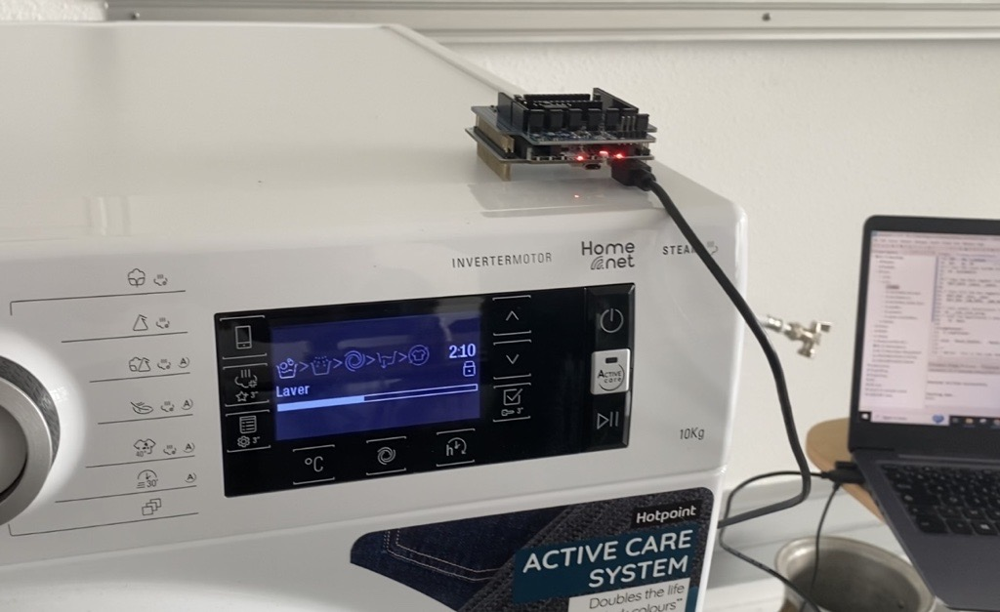

# SavEE
Codes des différentes parties du prototype du projet SavEE, dans le cadre des I-NOVGAMES

# Introduction
Pour répondre à la problèmatique : Comment l'IoT contribue à un monde plus durable ?, l'équipe de l'école ISEN Méditerranée présente son projet SavEE. Save, Eau, Electricité. 

Les étudiants ont décidé de s'intéresser à la consommation d'électricité dans un foyer ainsi qu'à la détection d'anomalies de consommation d'eau. Le projet se découpe en 3 parties. 

# IA pour la désintégration
Le but de cette partie est de pouvoir reconnaître la signature électrique de différents équipements pour en faire de la classification à partir des données de consommation fournir par le compteur LINKY à travers l'ERL. 

Ces données seront récupérées en décimale pour être traités par Nanoedge Studio AI en amont (le fonctionnement de chaque équipement pour en aval reconnaître les équipements qui fonctionnent). Et pour aller plus loin, on fera de l'anomalie détection pour reconnaître aussi les anomalies liées à l'usage de chaque équipement pour une maintenance prédictive. 

# Détection d'anomalies
L'objectif de cette partie est de détécter une anomalie de fonctionement d'appareils grâce à ses vibrations qu'on analysera avec un accelerometre (nucleo-WB55 et un iks01A3)

Nos cas d'usage sont une machine à laver ainsi qu'un tuyau.
 
Pour le tuyau on pourra détecter si il fonctione normalement ou non, c'est à dire qu'on sera capable de détecter une fuite sur le tuyau. L'objectif est de réduire les pertes d'eau.

Pour la machine, on pourra détecter un dysfonctionnement grâce aux 2 accelerometres qui y seront placés: un sur la machine et un sur le tuyau d'arrivée d'eau de la machine (voir photo). L'objectif est de réduire les pertes d'eau et les consomations d'électricité.

Pour permettre ceci nous avons collectés des datas de nos 2 cas d'usage: la machine et de son tuyau ainsi que de notre prototype de tuyau avec une fuite. Nous avons utilisé une nucleoL152RE ainsi que le logiciel unicleo-GUI pour collecter ces datas(vibrations sur 3 dimensions). Nous avons collectés plusieurs classes de datas: lors de fonctionement normal ansi que lors de fonctionement avec anomalie.

Ces datas ont ensuite été traitées par une IA: nanoedgeAI qui nous a donné des librairies associés. Ces librairies sont ensuite utilisées avec un code et une nucleo-WB55 afin de pouvoir détecter ces anomalies.

# TIC made in SavEE

# Connectivité
https://www.canva.com/design/DAFhGJYLjHA/FmaJW0r7sD-M4_MSMO0pXw/view?utm_content=DAFhGJYLjHA&utm_campaign=designshare&utm_medium=link&utm_source=publishsharelink   
